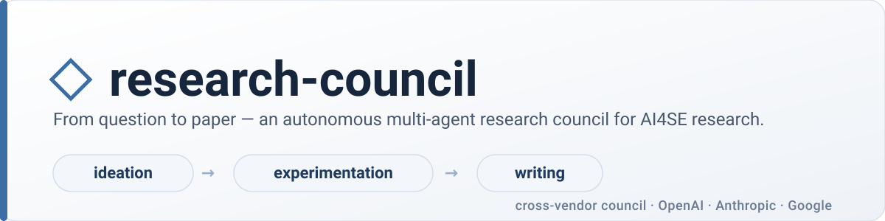

<p align="center">
  
</p>

<p align="center">
  
  
  
  
  
  
</p>

**research-council** runs three rival frontier models — **OpenAI · Anthropic · Google** — as a single council that carries a research idea **from question to paper**. Work flows through three human-gated stages, each a real engine, not a prompt:

**① Ideation** — the council debates a full research proposal · **② Experimentation** — it implements & runs the experiments in a sandbox · **③ Writing** — it drafts, peer-reviews against a venue rubric, and compiles the paper.

It runs **fully offline** with deterministic stubs (no API keys) for a lifecycle dry-run, or **live** with your own keys for real results.

## Quick Start (Dry-run)

```bash
# 1 · install the toolchain, venv, and deps (once)
mise trust && mise install && mise run deps

# 2 · dry-run the whole lifecycle OFFLINE — no API keys, no Docker (stub council)
mise exec -- council run --topic "Do LLM agents catch security bugs better than SAST?"
#   → walks ideation → experimentation → writing, pausing at each gate for your go/redo/stop
```

That exercises the full state machine with stub agents so you can see the flow end-to-end. For real proposals, experiments, and papers, **go live** (next section).

> Tip: `eval "$(mise activate zsh)"` once (e.g. in `~/.zshrc`) and you can drop the `mise exec --` prefix — just `council …`.

## Install & Setup

[mise](https://mise.jdx.dev/) manages the Python toolchain, the `.venv`, env vars, and tasks.

```bash
mise trust && mise install     # Python 3.14 + auto-created .venv
mise run deps                  # install the package + dev/providers/service extras
mise run test                  # 123 offline tests
```

**To run live** (`--live`), you need:

| Requirement | Why | Check |
| --- | --- | --- |
| API keys (OpenAI · Anthropic · Google) | the three council seats | `cp mise.local.toml.example mise.local.toml`, add keys, then `council check` |
| **Docker** running | Stage B runs generated code in an isolated sandbox (`--network none`) | `docker info` |
| `tectonic` or `latexmk` *(optional)* | Stage C compiles `paper.pdf` (else it emits `paper.tex`) | `tectonic --version` |

Optional: `mise run build-image` builds a sandbox image with the scientific stack (numpy/pandas/scipy/scikit-learn) so experiments aren't limited to the standard library.

## How to run

**One conversation (recommended)** — the conductor walks all three stages and asks you at each gate:

```bash
council run                              # offline dry-run
council run --live --profile balanced    # real engines
```

**Or drive it stage by stage** (scriptable / resumable — re-running a stage *improves* its existing artifacts rather than rebuilding):

```bash
council project new    --topic "…" --live           # → Stage A (ideation)
council project status <id>                          # where it is + the proposal
council project approve <id> --live                  # → runs Stage B
council project approve <id> --live --venue icse     # → runs Stage C
council project approve <id>                          # → marks the project complete
```

| Flag | Meaning |
| --- | --- |
| `--live` | use real models (omit for offline stubs — no keys/Docker) |
| `--profile` | `conservative` \| `balanced` \| `thorough` (caps for all stages) |
| `--venue` | `icse` · `fse` · `ase` · `neurips` · `emnlp` · `iclr` · `generic` (else the council recommends one) |
| `--allow-local-sandbox` | run generated code **unsandboxed** if Docker is absent (unsafe; opt-in) |

## How it works

A project moves through three stages; **you approve each transition**. The same council (codenamed Aiden·Cathy·Julien, one per vendor) plays a different role per stage.

```
question ─▶ ① IDEATION ──▶ ② EXPERIMENTATION ──▶ ③ WRITING ─▶ paper
            debate a          one sandboxed loop      draft · PC-review
            proposal          per research question   vs venue rubric · revise
              │ gate              │ gate                  │ gate
              ▼                   ▼                        ▼
         proposal.md       experiment/results.csv      paper/paper.pdf
```

| Stage | The council… | Output |
| --- | --- | --- |
| **① Ideation** | research independently → propose a full proposal (problem · hypothesis · method · plan · RQs · metrics) → debate & critique → score anonymously | `proposal.md` |
| **② Experimentation** | one loop **per research question**: a peer implements, two cross-vendor peers review the code *and* result (with sandbox probes) → revise until **feasible + approved** | `experiment/results.csv` + per-RQ code/logs/reviews |
| **③ Writing** | a lead drafts → two reviewers score against the **venue rubric** + file change-requests → revise → coherence pass → **LaTeX build-verify-fix** | `paper/paper.md` (+ `paper.pdf`) |

Every claim must cite a reference or show experiment evidence. Offline runs use stub peers; `--live` uses real agentic peers with retrieval (OpenAlex / arXiv / Semantic Scholar / GitHub) and a grounded LLM-wiki.

## Configuration

Everything is tuned in **`mise.toml`**. Set the models per seat (`RC_OPENAI_MODEL`, `RC_ANTHROPIC_MODEL`, `RC_GEMINI_MODEL`, `RC_FACILITATOR_MODEL`) and pick a cap profile with **`RC_PROFILE`**, which scales all three stages:

| `RC_PROFILE` | Ideation (rounds · msgs/peer) | Stage B (iters · K · $/RQ) | Stage C (revisions · accept · $) |
| --- | --- | --- | --- |
| `conservative` | 2 · 2 | 2 · 1 · $0.60 | 2 · 0.65 · $0.60 |
| **`balanced`** (default) | 4 · 3 | 3 · 2 · $1.50 | 3 · 0.70 · $1.50 |
| `thorough` | 6 · 4 | 5 · 2 · $4.00 | 5 · 0.78 · $4.00 |

Any individual cap is overridable — uncomment a `RC_MAX_*` / `RC_STAGEB_*` / `RC_STAGEC_*` line in `mise.toml`. Precedence: **per-field env > profile > default**.

## Outputs

Everything for a project lives under `projects/<id>/`:

```
projects/<id>/
├── project.json        # lifecycle state + every stage's artifacts
├── proposal.md         # ① the research proposal (problem · hypothesis · RQs · …)
├── experiment/         # ② one council loop per RQ
│   ├── results.csv     #    aggregated: rq · metric · value · feasible · approved · …
│   └── rq1/ rq2/ …     #    per RQ: experiment.py · log.txt · reviews.md
└── paper/              # ③ paper.md · sections/ · review.md · paper.tex/pdf
runs/<id>/trace.jsonl   # full event trace for every run
```

## Design & status

The full A→B→C lifecycle has **real engines** end-to-end and also runs offline via stubs. A FastAPI backend exists for Stage A; the conductor logic is the shared core a web UI will sit on. Live providers, real retrieval, the LLM-wiki librarian, and Docker-sandboxed experiments are all built.

Design docs live in [`plan/`](plan/1_sota-gap-analysis.html) (HTML — open in a browser). Recent: [13](plan/13_research-lifecycle.html) lifecycle · [18](plan/18_stage-bc-loops.html) Stage B/C loops · [19](plan/19_conversational-conductor.html) conductor · [20](plan/20_proposal-and-evidence.html) proposal + evidence · [21](plan/21_rq-driven-experiments.html) RQ-driven experiments · [23](plan/23_deliberation-balance.html) deliberation balance + caps.

*Not yet published to PyPI; no CI. Local development via `mise`.*
